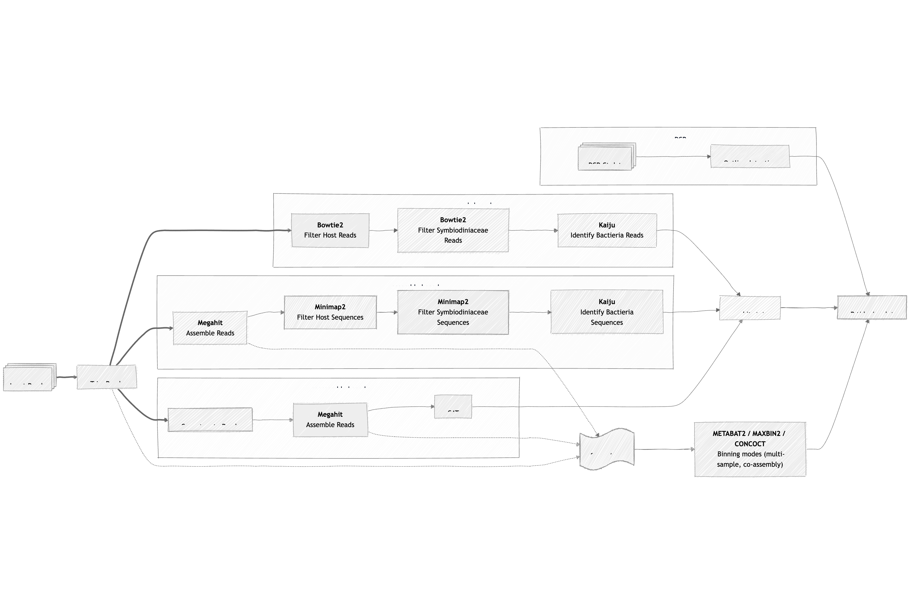

# metaG_EukDepletion

[](https://doi.org/10.5281/zenodo.19912537)

Code used for analysis of kingdom taxonomy to assess the development of a cnidarian metagenomic protocol for efficient eukaryotic DNA removal

---

## Flowchart

<!--  -->

```mermaid
---
config:
  layout: elk
  theme: default
  fontFamily: '''Open Sans Variable'', sans-serif'
  themeVariables:
    fontFamily: '''Open Sans Variable'', sans-serif'
---
flowchart LR
    A@{ shape: procs, label: "Input Reads" }
    A ==> B["Trim Reads"]
    B ==> C["<div style='font-weight:bold'>Bowtie2</div> Filter Host Reads"]
  subgraph "reads based"
    C --> D["<div style='font-weight:bold'>Bowtie2</div> Filter Symbiodiniaceae Reads"]
    D --> E["<div style='font-weight:bold'>Kaiju</div> Identify Bactieria Reads"]
  end
  
    B ==> F["<div style='font-weight:bold'>Megahit</div>Assemble Reads"]
  subgraph "assembly based" 
    F --> G["<div style='font-weight:bold'>Minimap2</div> Filter Host Sequences"]
    G --> H["<div style='font-weight:bold'>Minimap2</div> Filter Symbiodiniaceae Sequences"]
    H --> J["<div style='font-weight:bold'>Kaiju</div> Identify Bactieria Sequences"]
  end
    B ==> K[Concatenate Reads]
  subgraph "coassembly based"
    K --> L["<div style='font-weight:bold'>Megahit</div>Assemble Reads"]
    L --> M[CAT]
  end
  L -..-> N
  F -..-> N
  B -..-> N
  N@{ shape: paper-tape, label: "nf-core/mags" }
  N --> O["<div style='font-weight:bold'>METABAT2 / MAXBIN2 / CONCOCT</div> Binning modes (multi-sample, co-assembly)"]


  M --> S[seqkit stats]
  E --> S
  J --> S

  S --> P[R tidyr/ggplot]
  O --> P
  R --> P
  subgraph qPCR
    Q@{ shape: procs, label: "qPCR Ct data" }
    Q --> R[Outlier detection]
  end
  ```

---

## Prerequisites

- Nextflow
- Conda / mamba for environment management
- Kaiju database files:
  - `nodes.dmp`
  - `kaiju_db_refseq.fmi`
- Pre-built reference genome indexes (Bowtie2 for reads-based; Minimap2 for assembly-based):
  - Host — Aiptasiidae or Scleractinia
  - Symbiont — Symbiodiniaceae

> Taxon IDs used in the manuscript: `42823` (Aiptasiidae), `6127` (Acropora), `46730` (Pocillopora), `46719` (Porites), `252141` (Symbiodiniaceae)

---

## Pipeline overview

The pipeline runs **three parallel branches** from trimmed reads:

| Branch | Subworkflow | Steps |
|---|---|---|
| Reads-based | `MAP_CONSE_PE` | Bowtie2 (host) → Bowtie2 (Symbiodiniaceae) → Kaiju |
| Assembly-based | `MAP_CONSE_ASSEMBLY` | MEGAHIT → Minimap2 (host) → Minimap2 (Symbiodiniaceae) → Kaiju |
| Co-assembly / CAT | `CAT_WORKFLOW` | Reads grouped by species+method+buffer → CAT contig classification |

### Input file naming assumptions

FASTQ files follow this naming pattern:

```
{species}_{replicate}_{method}_{buffer}_{1,2}.fq.gz
```

Species codes currently recognised by the pipeline:

| Code | Mapped to |
|---|---|
| `Ac`, `Acro` | Acropora |
| `Po`, `Por` | Porites |
| `Poci`, `Pr` | Pocillopora |
| `F003`, `F3` | F003 (Aiptasia) |
| `H2` | H2 (Aiptasia) |

> Edit input channel logic in [main.nf](main.nf) to add/remove.
---

## Step-by-step setup

### 1. Clone the repository

```bash
git clone https://github.com/ColinL1/metaG_EukDepletion.git
cd metaG_EukDepletion
```

### 2. Build the Kaiju database — [GitHub](https://github.com/bioinformatics-centre/kaiju)

Pre-built indexes can be downloaded directly from the Kaiju [downloads page](https://bioinformatics-centre.github.io/kaiju/downloads.html):

```bash
wget https://kaiju-idx.s3.eu-central-1.amazonaws.com/2024/kaiju_db_nr_2024-08-25.tgz
tar xvf kaiju_db_nr_2024-08-25.tgz
```

Or build from scratch with:

```bash
kaiju-makedb -s refseq
```

### 3. Download reference genomes — [NCBI Datasets](https://github.com/ncbi/datasets)

```bash
# Example for Acropora (taxon 6127)
datasets download genome taxon 6127 --reference
unzip ncbi_dataset.zip
cat ncbi_dataset/*/*.fna > 6127_genome.fna && pigz 6127_genome.fna
```

Repeat for each reference taxon (host and symbiont).

### 4. Build reference indexes

**Bowtie2** (reads-based branch):

```bash
bowtie2-build 6127_genome.fna.gz 6127_genome -p number_threads --large-index
```

**Minimap2** (assembly-based branch):

```bash
minimap2 -x asm5 -d 6127_genome.mmi 6127_genome.fna.gz -t number_threads
```

### 5. Configure and run

Copy and edit the example config:

```bash
cp nextflow.config.example nextflow.config
# Edit paths for references, Kaiju DB, and resource limits
```

```bash
nextflow run main.nf -profile conda \
  --input path/to/reads/ \
  --outdir path/to/results/
```

> **Important:** Adjust CPU and RAM limits in `nextflow.config` and `process_resources.config` to match your machine.
