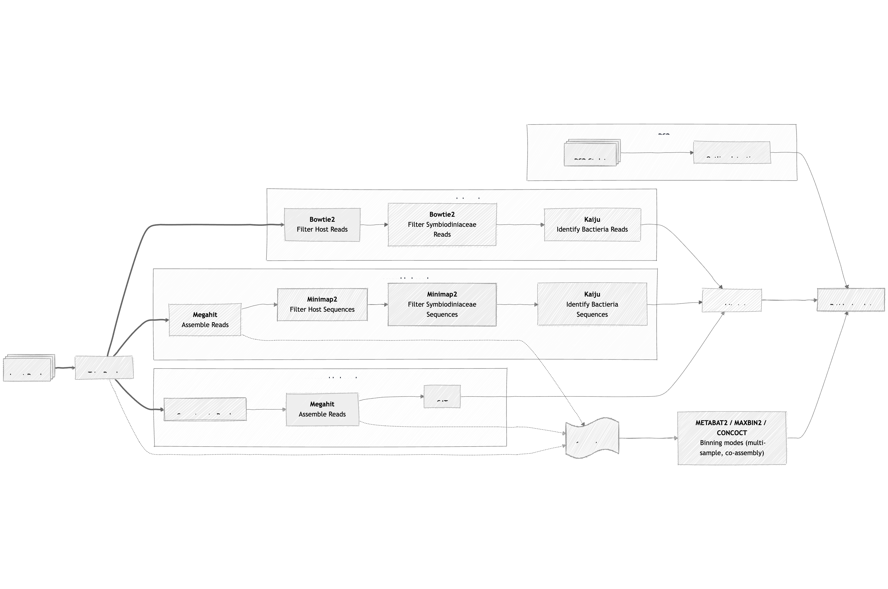

# metaG_EukDepletion
Code used for analysis of kingdom taxonomy to assess the development of a cnidarian metagenomic protocol for efficient eukaryotic DNA removal
  - - -

## Flowchart

<!--  -->

```mermaid
%% %%{
%%   init: {
%%     'theme': 'base',
%%     'themeVariables': {
%%       'primaryColor': '#BB2528',
%%       'primaryTextColor': '#fff',
%%       'primaryBorderColor': '#7C0000',
%%       'lineColor': '#F8B229',
%%       'secondaryColor': '#006100',
%%       'tertiaryColor': '#fff'
%%     }
%%   }
%% }%%
flowchart LR

  %% Reads based section
    A@{ shape: procs, label: "Input Reads" }
    A ==> B["Trim Reads"]
    B ==> C["<div style='font-weight:bold'>Bowtie2</div> Filter Host Reads"]
  subgraph "reads based"
    C --> D["<div style='font-weight:bold'>Bowtie2</div> Filter Symbiodiniaceae Reads"]
    D --> E["<div style='font-weight:bold'>Kaiju</div> Identify Bactieria Reads"]
  end

  %% Assembly based section
  
    B ==> F["<div style='font-weight:bold'>Megahit</div>Assemble Reads"]
  subgraph "assembly based" 
    F --> G["<div style='font-weight:bold'>Minimap2</div> Filter Host Sequences"]
    G --> H["<div style='font-weight:bold'>Minimap2</div> Filter Symbiodiniaceae Sequences"]
    H --> J["<div style='font-weight:bold'>Kaiju</div> Identify Bactieria Sequences"]
  end

  %% CoAssembly based section
    B ==> K[Concatenate Reads]
  subgraph "coassembly based"
    K --> L["<div style='font-weight:bold'>Megahit</div>Assemble Reads"]
    L --> M[CAT]
  end

  %% Binning
  L -..-> N
  F -..-> N
  B -..-> N

  %% Output and Analysis
  N@{ shape: paper-tape, label: "nf-core/mags" }
  N --> O["<div style='font-weight:bold'>METABAT2 / MAXBIN2 / CONCOCT</div> Binning modes (multi-sample, co-assembly)"]


  M --> S[seqkit stats]
  E --> S
  J --> S

  S --> P[R tidyr/ggplot]
  O --> P
  R --> P

  %% Dummy connections to enforce layout

%% qPCR section
  subgraph qPCR
    Q@{ shape: procs, label: "qPCR Ct data" }
    Q --> R[Outlier detection]
  end
  
  ```
 - - -

<details>
  <summary>
  Previous version logic. Discarded after project abandoned ONT data
  </summary>

#### Flow chart (Temp)


Detailed and further documentation coming soon with final script versions. 

Processes:
1. Optional:
    - trim ONT reads
    - Assemble reads with megahit
1. Run kaiju-multi on collection of samples (kaiju-multi has proven more efficient than individual kaiju parallelized do to persistance of kaiju database in RAM across projects.)
    - Split sequences in bacteria-matching and all the non-bacteria
1. Map non-bacteria with minimap2 to host reference genome (S)
    - Split sequences in Scleractinia-matching and non-scleractinia
1. Map non-Scleractinia with minimap2 to Symbiodinacea reference genome (main symbiont)
    - Split sequences in Symbiodinacea-matching and non-Symbiodinacea
1. Run all individual sequences file trough fastp to generate individual report.json files
1. Parse all json report with custom python script collecting them in single csv report ready for downstream data analyses 

<!-- More detailed workflow explanation coming soon. -->

  - - -

### Pre-requisites: 

- Nextflow
- Conda
- Kaiju
    - nodes.dmp
    - kaiju_db_refseq.fmi 
- Reference genomes (fasta format)
    - Host (i.e.: Scleractinia and Aiptasia)
    - Other main symbiont (i.e.: Symbiodiniaceae)
- Minimap2 indexed reference genomes (from above Reference genome fasta file)
    - e.g: reference.mmi
- Any other dependencies listed in [environment.yaml](environment.yaml)

  - - -

## Step-by-step
### Databases creation
#### Kaiju refseq - [Github](https://github.com/bioinformatics-centre/kaiju)
<details>
  <summary> Instructions </summary> 
References database indexes created from standard `refseq` reference database with the command:

```
kaiju-makedb -s refseq
```
Pre-built indexes for the reference database can be downloaded from the official Kaiju [website](https://bioinformatics-centre.github.io/kaiju/downloads.html). 
</details>

#### NCBI Datasets - [Github](https://github.com/ncbi/datasets)
<details>
  <summary> Instructions </summary> 
  
Download whole taxon reference genomes record and collect in single fasta file

    Example for "Scleractinia" - Taxonomy ID: 6125

```
# Download all the reference genome associated with the 6125 taxon
datasets download genome taxon 6125

# Unzip the files
unzip ncbi_dataset.zip

# Join together in single fasta file ready for indexing
cat ncbi_dataset/data/*/*.fna > ref_scleractinia.fna
```
</details>

#### Minimap2 indexes - [Github](https://github.com/lh3/minimap2)
<details>
  <summary> Instructions </summary> 

Pre-compute the minimap2 indexes for reference mapping 

    Continuing with the above example for "Scleractinia" 
```
# Pre-compute indexes 
minimap2 -d ref_scleractinia.mmi ref_scleractinia.fna
```
</details>

#### Clone the repo and lunch the pipeline
<details>
  <summary> Instructions </summary> 

```
git clone https://github.com/ColinL1/metaG_EukDepletion.git

nextflow run main.nf -profile conda --input path-to-input-folder-with-reads --outdir path-to-output-dir
```
> **Important:** Tweak the cpu and ram parameters in the configuration files to match your machine capacity 

</details>
<!-- ### TEST RELEASE!

Detailed and further documentation coming soon with final script versions. 

Requirements:
- Kaiju refseq databse 
- genome host (coral and aiptasia)
- genome Symbiondiancea
- mmseq2 nt/blast database (optional)


More detailed workflow explanation coming soon.
 -->

</details>

<!-- ## Quick start:
```
git clone 

nextflow run main.nf -profile conda --input path-to-input-folder-with-reads --outdir path-to-output-dir
``` -->