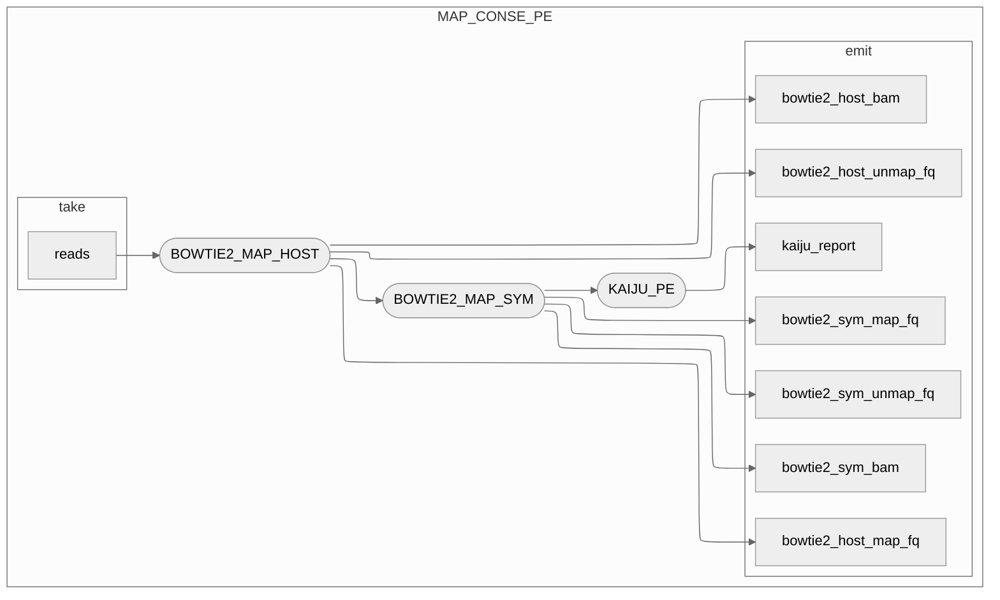
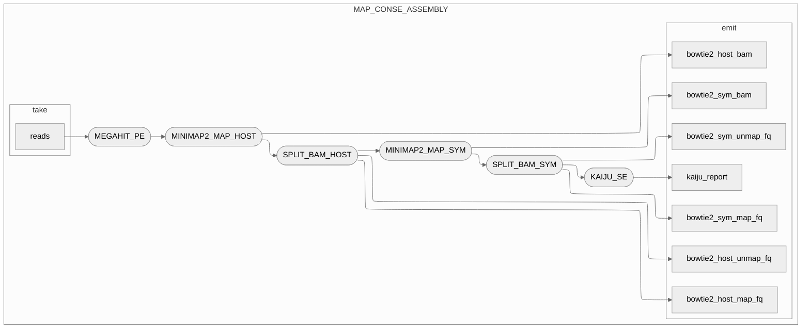

# Collection of subworkflows used in the pipeline

## Logic

<details>
  <summary> map_conse_pe </summary>


</details>

<details>
  <summary> map_conse_assembly</summary>



</details>

### Folder content

```text
subworkflows
├── README.md               <-- you are here. 
├── CAT.nf
├── exploratory             # A subset of subworkflow or subworkflow ideas. Not actively used in the pipeline. No guarantee any of this code is functional
│   └── archived_old-logic  # As the folder says. Previous snippets of code from the previous version of the pipeline.
├── k2b.nf
├── map_conse_assembly.nf
└── map_conse_pe.nf
```
